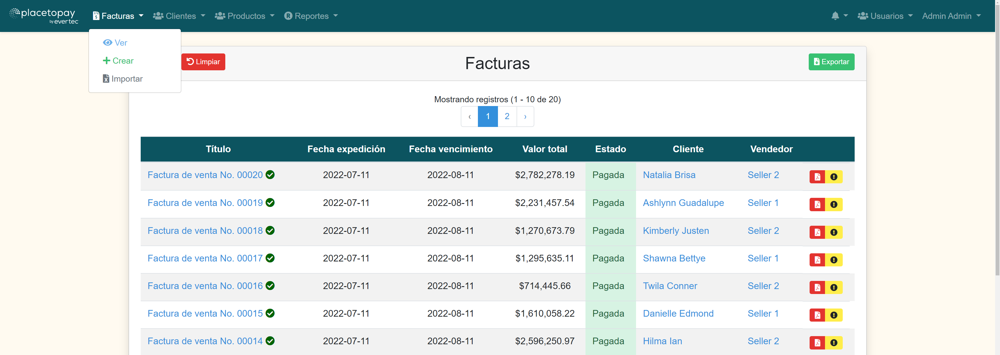

<p align="center"><a href="https://laravel.com" target="_blank"></a></p>

<p>
<h1 align="center">Invoice System Manager</h1>

<p align="center">
<a href="https://github.com/laravel/framework/actions"></a>
<a href="https://packagist.org/packages/laravel/framework"></a>
<a href="https://packagist.org/packages/laravel/framework"></a>
<a href="https://packagist.org/packages/laravel/framework"></a>
</p>

In this repository you can find the source code of the project based on a invoice system made with Laravel 6 framework.

- [Introduction](#introduction)
    - [Features](#features)
    - [Technologies](#technologies)
- [Get started](#get-started)
    - [Requirements](#requirements)
    - [Installation](#installation)
- [License](#license)

## Introduction

This invoice system is thought as a very small CRM when you can manage clients, products and invoices. These clients can have an user to enter to the system and see/pay their invoices and manage their personal information. 

<p align="center">



</p>

### Features

* API REST.
* Session manage. Login via WEB or API with JWT
* Multi login (admin and clients).
* List, create, see, update and delete invoices.
* List, create, see, update and delete clients.
* List, create, see, update and delete products.
* Import and export invoices supporting different formats like xlsx, csv, tsv.
* Import and export clients supporting different formats like xlsx, csv, tsv.
* Import and export products supporting different formats like xlsx, csv, tsv.
* Generate invoices PDF.
* Search, filter and paginate invoices, clients and products.
* Integration with PlacetoPay payment gateway to pay invoices.
* Transaction control status of invoices.
* Visualization of historic payment attempts of invoices and their details.
* Generation and download of reports supporting different formats like xlsx, csv, tsv.
* Manage ACL Roles and Permissions.
* Responsive design.
* Notifications to inform ready exports to be downloaded.

### Technologies and methodologies

* PHP with Laravel 6 Framework and MySQL Database.
* GITFLOW.
* PSR 1, PSR 4, PSR 12 standard coding styles.
* Test Driven Development (TDD) with PHPUnit.
* Usage of preprocessors to build users views (SASS).
* Usage of Laravel Mix to build project assets (CSS, JS).
* Validation of all user entered data to preserve DB integrity using Form Requests.
* Use of Queue Jobs to manage modules and reports exports.
* Usage Vue 2 to manage autocomplete relational inputs.
* Usage Vue 2 to manage notifications.
* Bootstrap.

## Get started
There are multiple ways of getting started:

### Demo
You can enter to [heroku deployed demo](https://ptp-invoice-system.herokuapp.com/login).

### Installation
#### Requirements
- PHP ^7.2
- HTTP server with PHP support (eg: Apache, Nginx, Caddy)
- Composer
- Git
- MySQL
- Node

#### Instructions
After clone the repository, open terminal and run the following commands:
```bash
cd invoice-system
composer install
npm install && npm run prod
cp .env.example .env
php artisan key:generate
```
Create database. For example in MySQL with root user:
```bash
mysql -u root
CREATE DATABASE invoice_system;
exit;
```
If you use want other database configurations, be sure to configure your `.env` file correctly.

Migrate tables and seed some fake data:
```bash
php artisan db:seed
```
You will be asked if you want to refresh all data and choose how many clients and invoices per client will be created.

To finish and serve the application, you should execute:
```bash
php artisan optimize:clear
php artisan serve
```

Also, you can configure a virtual host in your machine instead use laravel serve application.

And admin default user will be created with the following credentials:
* User: admin@example.com
* Password: secret

## License

Copyright © 2022

Licensed under [MIT license](LICENSE.md).
